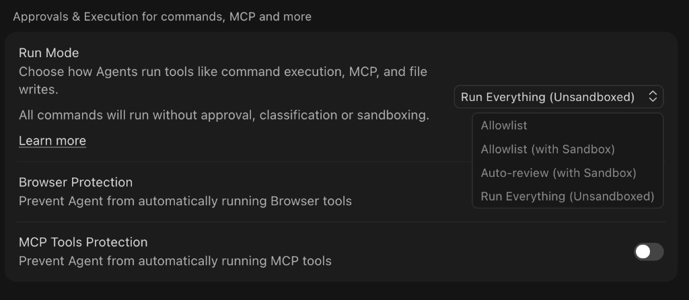

# FreeClimb Cursor Plugin

Cursor plugin for building and operating FreeClimb voice and SMS workflows with AI agents. It packages FreeClimb knowledge, guardrails, a first-run setup flow, and a standalone MCP server. The plugin is an internal monorepo with three packages — `@freeclimb/core` (shared HTTP, credentials, validation, errors, PerCL), `freeclimb-cli` (power-user CLI), and `@freeclimb/mcp` (the standalone stdio MCP server). Everything ships and updates through Cursor plugin sync; nothing is published to npm in v1.

## What It Does

This plugin lets an agent turn a business request into a working communications workflow or a privacy-safe operations dashboard. The core workflow demo:

1. Ask Cursor to create a simple FreeClimb support line.
2. The agent uses the plugin skills to design a small IVR.
3. The agent builds a local webhook app that returns PerCL.
4. The FreeClimb CLI runs the local development environment and tunnel.
5. You call the FreeClimb number live.

For operations and demos, ask Cursor to create a FreeClimb dashboard. The `render-freeclimb-dashboard` skill composes a constrained declarative specification, reads account data through MCP, and renders a point-in-time HTML dashboard inline. Ask it to refresh to capture a new snapshot.

## Install the plugin

A Cursor team admin adds this plugin from the repository:

1. In Cursor team settings, add a plugin from `https://github.com/FreeClimbAPI/freeclimb-plugin` (or import via `.cursor-plugin/marketplace.json` for team-marketplace distribution).
2. Members receive the plugin automatically.

Cursor syncs the repository as-is. The skills, rules, commands, and agent work immediately. The MCP tools require a one-time per-machine setup (below).

## First-run setup

The MCP server is the default surface — no global CLI install required. The first time you use the plugin on a machine, run:

```text
/freeclimb-setup
```

This command (see the `freeclimb-onboarding` skill) will:

1. Build the bundled MCP server once: from the plugin directory, run `pnpm run setup` (installs dependencies and builds `core/`, `mcp/`, and `cli/`). This produces `mcp/lib/bin.js`, which `.mcp.json` launches via `node ${CURSOR_PLUGIN_ROOT}/mcp/lib/bin.js`.
2. Connect your FreeClimb account via the browser:

   ```bash
   node mcp/lib/bin.js login
   ```

   A local page opens at `127.0.0.1`, deep-links your FreeClimb Dashboard → API Credentials, and lets you paste your Account ID and API Key into that local page. The pair is verified against the configured API environment before it replaces the credentials in your OS keyring. Never paste credentials into chat.
3. Reload Cursor so the MCP server starts.

Power users who want the CLI can additionally `pnpm i -g ./cli` to put `freeclimb` on their PATH; `freeclimb login` writes the same keyring, so either path authenticates the other.

Requirements: Node.js >= 20 (Node.js 22 recommended for development and CI; pnpm 11.5.3 requires Node.js >= 22.13) and a working build toolchain (native modules are compiled during install).

## Credentials

- The agent never sees, requests, or writes your Account ID or API Key.
- Interactive credentials live in the OS keyring, set by the browser login flow (`node mcp/lib/bin.js login`) or by `freeclimb login` if you install the CLI.
- The MCP server and CLI read the keyring automatically on each request. For CI only, `FREECLIMB_ACCOUNT_ID` / `FREECLIMB_API_KEY` and legacy `ACCOUNT_ID` / `API_KEY` env vars are used only when the corresponding keyring entry is absent or unavailable. Never commit them or paste them into chat.
- Production is the default API environment. Staging and custom environments use `FREECLIMB_CLI_BASE_URL`, which must be available to both the login process and Cursor's MCP process.

## Account management

Run `/freeclimb-account` to inspect the connected account, connect or switch accounts through the verified local browser flow, or log out. Switching replaces the current keyring credentials only after the new pair succeeds. Logging out removes the keyring entries and setup marker, then reports the names of any credential environment variables that could still act as fallbacks.

The same operations are available from the plugin root:

```bash
node mcp/lib/bin.js login
node mcp/lib/bin.js logout
```

## Official SDK workflow

When an agent builds a user application, it detects the project's language and loads only that language's SDK reference and matching template under `templates/`. Each of the six templates uses an exact official SDK release, SDK-native PerCL, raw-body request signature verification, absolute HTTPS action URLs, and non-billable contract tests. For specialized flows, the agent can select one pinned source from `sdk/content-index.json`; it retrieves only the matching quickstart or tutorial and adapts the product flow to the tested template.

The plugin runtime does not vendor or import generated SDKs, quickstarts, or tutorials, and normal generation does not require GitHub. MCP remains read-only through `@freeclimb/core`, while account-changing agent operations remain CLI-only. Run `pnpm sdk:validate` to verify SDK and content catalogs, `pnpm sdk:test` to test drift automation, and `pnpm sdk:drift` to compare tested releases, normalized OpenAPI contracts, and pinned content revisions with upstream repositories.

## Read-only MCP, CLI for actions

The FreeClimb MCP tools are **read-only**: they inspect the account (calls, SMS, numbers, applications, logs) and render read-only dashboards, but they cannot spend money or change the account. PerCL validation is local and deterministic through the automatic hook and `freeclimb percl:validate <file|-> --json`. Every billable or irreversible action (place calls, send SMS, buy numbers, update calls/applications) is performed through the **FreeClimb CLI**, which the agent runs as a terminal command with `--dry-run` and input validation.

This consolidates all account-changing operations onto a single surface that Cursor's command-execution approvals govern. We strongly recommend hardening these settings under **Cursor Settings → Agents → Approvals & Execution**:

| Setting | Recommended | Why |
| --- | --- | --- |
| **Run Mode** | `Allowlist` (not `Run Everything (Unsandboxed)`) | The agent's `freeclimb` action commands require approval/allowlisting instead of running unattended — this is the primary control for billable actions. |
| **Browser Protection** | Enabled | Prevents the agent from automatically running browser tools. |
| **MCP Tools Protection** | Enabled | Surfaces FreeClimb MCP tool calls for review (defense in depth; these are read-only). |



Because the MCP surface can no longer mutate the account, prompt-injection that reaches the agent cannot place calls or send SMS through MCP; it would have to issue a CLI command, which the approval/allowlist Run Mode gates. In addition, the plugin's `beforeShellExecution` hook downgrades billable FreeClimb CLI commands without `--dry-run` from auto-run to an explicit approval prompt. Always `--dry-run` and confirm intent before running an action command.

## API request controls

The shared `@freeclimb/core` HTTP client paces FreeClimb API traffic to 5 request starts per second with at most 2 requests in flight per process. Safe and idempotent requests retry transient failures (including HTTP 429 with `Retry-After`) up to 3 times; POST, PATCH, and DELETE are never retried automatically. Override with `FREECLIMB_REQUESTS_PER_SECOND`, `FREECLIMB_MAX_CONCURRENT_REQUESTS`, and `FREECLIMB_MAX_RETRIES` (set `0` to disable retries).

## Included Components

- Skills for FreeClimb concepts, PerCL call control, phone workflow building, privacy-safe dashboard rendering, flow verification, debugging, first-run onboarding, the official SDK catalog, SMS compliance, webhook security, incident triage, conferences/queues/recordings, MMS messaging, voice input and transcription, TTS, WebRTC calling, and blob-store state.
- A standalone FreeClimb MCP server entry (`command: "node", args: ["${CURSOR_PLUGIN_ROOT}/mcp/lib/bin.js"]`).
- A `/freeclimb-setup` command for first-run build and browser authentication.
- A `/freeclimb-account` command for viewing, switching, and disconnecting the active account.
- A `/build-freeclimb-phone-workflow` command for the demo flow.
- A `/freeclimb-test-flow` command to validate PerCL and simulate the webhook path before a live call.
- A `/freeclimb-status` command for a one-shot read-only account health check across calls, SMS, logs, and webhook configuration.
- An always-applied rule (`rules/freeclimb.mdc`) that is the canonical guardrail source: credential handling, read-only MCP vs CLI-for-actions, dry-run/confirmation, and trial-account limits. Agents and commands reference it instead of restating it.
- A contextual SMS compliance rule (`rules/sms-compliance.mdc`) for opt-out handling, consent, quiet hours, and 10DLC guardrails when composing or sending SMS.
- A `freeclimb-builder` agent (reads via MCP, acts via the CLI) and a read-only `freeclimb-operator` agent for safe inspection.
- Hooks for a first-run setup nudge (`sessionStart`), billable CLI approval (`beforeShellExecution`), immediate `.percl.json` validation feedback (`postToolUse`), and a bounded repair continuation (`stop`).
- Tested starter templates under `templates/` for Node/Express, Python/Flask, Java/Spring Boot, .NET minimal APIs, Ruby/Sinatra, and PHP/Slim using the official FreeClimb SDKs.

## Repository Layout

- `.cursor-plugin/plugin.json`: Cursor plugin manifest.
- `.mcp.json`: MCP server wiring (`node ${CURSOR_PLUGIN_ROOT}/mcp/lib/bin.js`, stdio).
- `core/`: `@freeclimb/core` — shared HTTP, credentials, validation, errors, and PerCL generate/validate.
- `mcp/`: `@freeclimb/mcp` — the standalone stdio MCP server and browser login bin.
- `cli/`: `freeclimb-cli` — the power-user CLI frontend over `core`.
- `skills/`: Agent guidance for FreeClimb concepts, PerCL, workflow building, dashboard rendering, verification, debugging, onboarding, account management, SDKs, SMS compliance, webhook security, incident triage, conferences/queues/recordings, MMS messaging, voice input and transcription, TTS, WebRTC calling, and blob-store state.
- `commands/`: `/freeclimb-setup`, `/freeclimb-account`, `/build-freeclimb-phone-workflow`, `/freeclimb-test-flow`, and `/freeclimb-status`.
- `rules/`: FreeClimb guardrails (`freeclimb.mdc`) and SMS compliance (`sms-compliance.mdc`).
- `agents/`: `freeclimb-builder` (reads via MCP, acts via CLI) and `freeclimb-operator` (read-only) subagents.
- `hooks/`: Session setup nudge, the billable-CLI dry-run guard, and the automatic PerCL validation and repair loop for agent-written `.percl.json` files.
- `templates/`: Six reproducible starter apps using exact official SDK releases, SDK-native PerCL, and request verification.
- `sdk/sdk-matrix.json`: Machine-readable mapping from each supported language and package to its SDK repository, template, release convention, and OpenAPI source.
- `sdk/content-index.json`: Curated quickstart and tutorial metadata pinned to immutable source revisions.
- `scripts/sdk-matrix.mjs`: Deterministic SDK, template, exact-version, lockfile, and content-index validation.
- `scripts/check-sdk-drift.mjs`: Scheduled release, OpenAPI fingerprint, and indexed-content revision comparison.
- `demo/slides/`: HTML presentation deck and assets.

## Demo Prompt

```text
Create a simple FreeClimb support line for a small business.

When someone calls, greet them, ask them to press 1 for sales or 2 for support, and send anyone else to voicemail. Build the local webhook app, explain what FreeClimb resources are needed, and help me run it so I can call the number live.
```

Dashboard demo:

```text
Create a privacy-safe FreeClimb operations dashboard focused on account health, active calls, recent-call count, and recent-error count. Render it in the IDE without displaying identifiers, phone numbers, message bodies, or log text. After I place one inbound call, refresh the snapshot and summarize the aggregate change.
```

## Developing

The repo is a pnpm workspace with `core/`, `mcp/`, and `cli/`. From the repo root (enable pnpm once with `corepack enable && corepack prepare --activate`):

```bash
pnpm run setup    # install all workspaces + build core, mcp, cli
pnpm run build    # rebuild all packages (core -> mcp -> cli)
pnpm test         # run the core, mcp, and cli test suites
pnpm run validate # validate the plugin manifest/frontmatter and scan for secrets
```

SDK integration checks:

```bash
pnpm sdk:validate
pnpm sdk:test
pnpm sdk:drift
```

Protect `main` with the `plugin-validate`, `build`, `test`, and `sdk-templates` checks after the SDK workflow has run once on the default branch.

To work on the CLI directly:

```bash
cd cli
pnpm run prepack   # build lib/ and the oclif manifest
```
