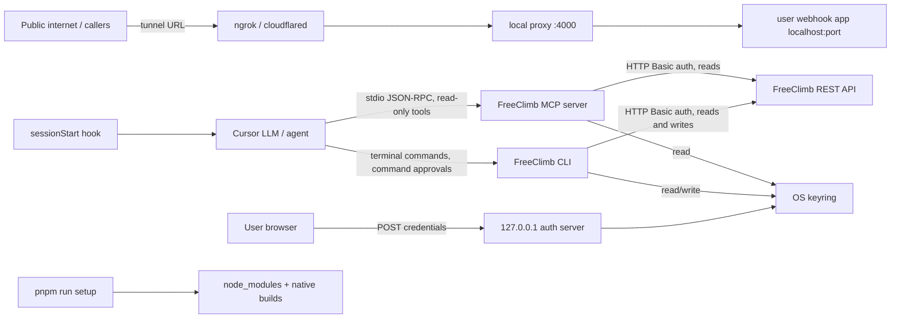

# Security Architecture Review (Self-Review): FreeClimb Cursor Plugin

Status: Draft for internal review
Reviewed artifact: `freeclimb` Cursor plugin v0.5.0 (`.cursor-plugin/plugin.json`) + private workspace packages `@freeclimb/core`, `@freeclimb/mcp`, and `freeclimb-cli`
Purpose: Pre-empt findings before the formal Security Architecture Review process.

This is an author self-review. Severities are a pre-review assessment, not final ratings, and are offered as input to the formal process.

## 0. Framing

The plugin splits the agent's FreeClimb surfaces by capability:

- The in-IDE MCP server is read-only. It inspects account resources and provides local PerCL/dashboard helpers.
- The FreeClimb CLI is the only plugin-provided surface for billable or account-changing actions.

This split is recorded in `docs/adr/0005-read-only-mcp-cli-for-actions.md`. It removes billable capability from the auto-executing MCP tool surface and consolidates every mutation onto the CLI, where execution is governed by Cursor command approvals/allowlists plus CLI `--dry-run` and validation.

The plugin does not add new FreeClimb account capabilities; it gives an agent structured access to operations already available through the FreeClimb REST API and CLI. The effective trust boundary is set by how much autonomy the user grants the agent, what terminal commands are approved, and which FreeClimb account credentials are connected.

## 1. System overview

The plugin is distributed to a Cursor team by syncing this repository as-is. It packages:

1. Agent assets: skills (`skills/`), a rule (`rules/freeclimb.mdc`), commands (`commands/`), agents (`agents/`), and hooks (`hooks/`).
2. A plugin-rooted MCP entry (`.mcp.json`) that launches `node ${CURSOR_PLUGIN_ROOT}/mcp/lib/bin.js`.
3. A private npm workspace with `@freeclimb/core`, `@freeclimb/mcp`, and `freeclimb-cli`.
4. A first-run flow (`/freeclimb-setup` + `freeclimb-onboarding` skill) that runs `pnpm run setup` once to install dependencies and build `core/`, `mcp/`, and `cli/`.
5. A browser login flow (`node mcp/lib/bin.js login`) that stores credentials in the OS keyring.

For v1, nothing is published to npm. `@freeclimb/core` and `@freeclimb/mcp` are private packages consumed through workspace symlinks. The synced plugin repository and committed root lockfile are the distribution and dependency integrity boundary. The MCP server runs standalone over stdio and does not depend on a global CLI install, `npx`, or runtime npm registry fetch.

The agent-facing credential path is keyring-first. The root `.mcp.json` has no credential `env` block, and `scripts/validate-plugin.mjs` rejects one if it is added. Environment variables remain supported only as a CLI/CI compatibility escape hatch and should not be placed in MCP client config or pasted into chat.

## 2. Trust boundaries

Boundaries crossed:

- Untrusted model input to MCP read tools and CLI command arguments.
- User-entered credentials to a loopback-only local auth server and then the OS keyring.
- Public tunnel traffic to a local webhook application during development.
- Dependency install scripts and native module builds during first-run setup.
- Plugin-provided hook execution in the user's environment.
- Phone numbers, SMS bodies, logs, and account metadata entering model context and transcripts.

## 3. Assets

- FreeClimb Account ID + API Key.
- FreeClimb account resources and account spend.
- The user's local machine and build environment.
- Local webhook applications and any local data they expose.
- PII and communications metadata in SMS, call, log, number, application, and recording data.

## 4. Existing controls

- Read-only MCP surface: the MCP server exposes no billable or account-changing tools.
- CLI-only mutations: calls, SMS, number purchases, call updates, and application creates/updates are performed through the CLI.
- Cursor command approvals/allowlist Run Mode is the governing host control for CLI actions.
- CLI mutating commands support `--dry-run` and shared input validation.
- Root `.mcp.json` launches `node ${CURSOR_PLUGIN_ROOT}/mcp/lib/bin.js` and contains no credential `env` block.
- MCP browser login binds `127.0.0.1`, uses a one-time state token, caps request bodies, times out, shuts down after capture, and writes credentials only to the OS keyring.
- `scripts/validate-plugin.mjs` validates plugin component paths, component frontmatter, root MCP config, and hook executability.
- `scripts/scan-secrets.mjs` fails CI if credential-shaped values (Account-ID/API-key patterns) appear in tracked files.
- `hooks/hooks.json` declares `sessionStart` (setup nudge) and a `beforeShellExecution` guard that requires approval for billable/irreversible FreeClimb CLI commands issued without `--dry-run`. The prior `beforeMCPExecution` guard was removed with the mutating MCP tools.
- Shared validation rejects control characters, path traversal in resource IDs, malformed phone numbers, and malformed URLs.
- Shared HTTP pacing in `@freeclimb/core` limits request starts and concurrency per process, honors `Retry-After` on HTTP 429, and avoids automatic retries for mutating methods.
- The dev proxy has a 1 MB body cap and strips hop-by-hop headers.
- `render_dashboard` validates and renders in-IDE via MCP Apps UI instead of writing temp files or returning shell commands.

## 5. Findings

### F1 (Resolved / Reframed) - Billable and irreversible actions are no longer MCP tools

The six mutating MCP tools were removed: `make_call`, `send_sms`, `buy_number`, `update_call`, `create_application`, and `update_application`. The `send-sms` and `make-call` MCP prompts were also removed.

Impact reduction: prompt injection that reaches the agent through read data, such as SMS bodies or logs, cannot trigger a billable MCP tool because those tools no longer exist.

Residual risk: the agent can still initiate the same actions through the CLI. This is intentional. The enforcement point is Cursor command execution approvals plus CLI `--dry-run` and validation, not a bespoke MCP hook.

### F2 (High / Medium) - `freeclimb dev` exposes the local app to the public internet

`freeclimb dev` opens a public tunnel to a local proxy that forwards requests to the developer's local application. There is no webhook signature verification in the proxy today.

Impact: anyone with the tunnel URL can reach the developer's local app for the lifetime of the session.

Recommendation: document the exposure prominently, use throwaway local apps for demos, and confirm whether FreeClimb provides a webhook signature or IP allowlist suitable for verification.

### F3 (Medium) - First-run setup executes dependency install scripts

The first-run flow runs `pnpm run setup`, which installs workspace dependencies and builds local packages. Native dependencies such as keyring/tunnel packages may execute install scripts.

Impact: dependency install scripts execute locally with the user's privileges.

Mitigations: root `pnpm-lock.yaml` is committed, CI uses `pnpm install --frozen-lockfile`, nothing is fetched at MCP runtime, and no global CLI install is required for MCP.

Recommendation: keep lockfile-based installs, review dependency updates, and consider a signed/published artifact in a future distribution model.

### F4 (Medium) - Residual credential compatibility paths remain

The agent-facing MCP config is credential-free and keyring-based, but the shared core still supports env-var fallback and `.env` persistence for CLI/CI compatibility.

Impact: credentials may live outside the keyring in CLI or CI scenarios.

Recommendation: keep MCP config credential-free, document env fallback as CLI/CI-only, and deprecate generic `ACCOUNT_ID` / `API_KEY` plus plaintext `.env` persistence when compatibility allows.

### F5 (Medium / Low) - Raw `api` command remains a power-user escape hatch

The raw CLI API command can send authenticated requests not covered by named commands. It includes host allowlist and path traversal checks, but `--raw` remains intentionally less abstracted than generated commands.

Impact: malformed or over-broad CLI commands can still perform account-changing actions if approved by the user.

Recommendation: continue to treat raw API use as advanced/power-user behavior, require `--dry-run` for mutations where available, and keep Cursor command approvals enabled.

### F6 (Low) - Plugin-provided shell hooks execute automatically

Two hooks run automatically: `hooks/freeclimb-session-start.sh` (a read-only setup nudge) and `hooks/freeclimb-cli-guard.mjs` (a `beforeShellExecution` guard that inspects the proposed command string and downgrades billable FreeClimb CLI commands without `--dry-run` from auto-run to ask). Neither reads credentials, makes network calls, or mutates state; the guard fails open to Cursor's own command approval flow.

Impact: plugin hooks remain part of the host execution trust surface.

Recommendation: keep hooks minimal, side-effect-light, and read-only over their inputs.

### F7 (Low / Medium) - PII flows into model context and transcripts

Read MCP tools can return phone numbers, SMS bodies, call metadata, application URLs, logs, and recording metadata into the agent context.

Impact: chat transcripts may contain communications data.

Recommendation: document model-visible data classes, prefer field-minimized list views, and avoid retrieving full SMS/log payloads unless needed.

### F8 (Resolved) - Dashboard rendering no longer writes temp files or returns shell commands

`render_dashboard` now validates dashboard specs and renders in-IDE via MCP Apps UI. It does not write predictable temp files or return shell commands for the agent to run.

### F9 (Medium) - Loopback browser auth is a secret-handling surface

The MCP browser login flow receives Account ID/API Key through a local page and writes them to the OS keyring.

Impact: if the listener were reachable beyond loopback, lacked request authenticity, or logged/persisted the key, credentials could be exposed.

Mitigations: loopback-only bind, one-time state token, short TTL, request body cap, immediate shutdown, and keyring-only write.

## 6. Resolution status

- F1: resolved/reframed by ADR 0005. MCP is read-only; all writes go through CLI.
- F2: carried forward as local development residual risk.
- F3: partially mitigated by committed lockfile, private workspaces, and no runtime MCP registry fetch.
- F4: partially mitigated for MCP; CLI/CI compatibility paths remain.
- F5: path traversal and host controls exist; raw API remains an advanced CLI path.
- F6: two minimal hooks — a `sessionStart` nudge and a read-only `beforeShellExecution` dry-run guard.
- F7: accepted model-context privacy risk with minimization guidance.
- F8: resolved by in-IDE MCP Apps UI rendering.
- F9: implemented with loopback auth hardening.

## 7. Open questions for formal review

- Does FreeClimb sign webhooks, and can the dev proxy verify those signatures?
- What spend-control policy is required beyond CLI dry-runs and Cursor command approvals?
- Are chat transcripts containing phone numbers, SMS bodies, or logs in scope for retention/privacy controls?
- When can legacy env names and plaintext `.env` persistence be removed from the distributed build?
