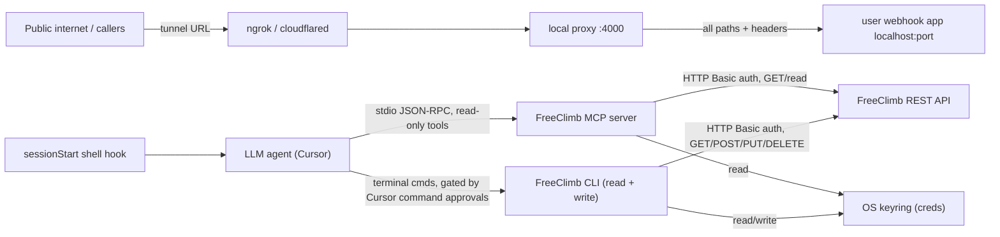

# Security Architecture Review (Self-Review): FreeClimb Cursor Plugin

Status: Draft for internal review
Reviewed artifact: `freeclimb` Cursor plugin v0.2.0 (`.cursor-plugin/plugin.json`) + bundled FreeClimb CLI v0.6.0 (`cli/package.json`)
Purpose: Pre-empt findings before the formal Security Architecture Review process.

This is an author self-review. Severities are a pre-review assessment, not final ratings, and are offered as input to the formal process.

## 0. Framing

The plugin splits the agent's two surfaces by capability: the in-IDE MCP server is **read-only** (it inspects the account and generates/validates PerCL locally), and the agent-friendly FreeClimb CLI is the only surface that performs billable or account-changing actions. The operations either surface exposes are the same FreeClimb account operations already available through the FreeClimb REST API (see `docs/adr/0001-monorepo-plugin-and-cli.md`); the plugin does not add new account capabilities. This split is recorded in `docs/adr/0005-read-only-mcp-cli-for-actions.md`: it removes billable capability from the auto-executing MCP tool surface and consolidates every mutation onto the CLI, where execution is governed by Cursor's command-approval/allowlist Run Mode plus the CLI's `--dry-run`/validation.

Because the capabilities are not new, the effective trust boundary is not fixed by the plugin: it is set by how much autonomy the user chooses to grant their agent (which MCP tools are enabled, whether mutating tools require confirmation, and what the agent may do unattended), together with the FreeClimb credentials and account the user authenticates with. Ultimately the user of the plugin is responsible for the actions their agent takes on their account. The findings below identify where the plugin can make safe defaults easier and where the autonomy/responsibility tradeoff should be made explicit, rather than implying the plugin introduces capabilities that did not already exist.

### In-flight architecture overhaul

An overhaul is underway (`decouple mcp and cli` plan) that restructures the artifact and directly resolves several findings in this review. The target architecture splits the bundled CLI into an internal three-package npm workspace, `@freeclimb/core` (shared http/credentials/validation/errors/PerCL), `freeclimb-cli` (thin oclif/ink frontend), and `@freeclimb/mcp` (standalone MCP server), with the following security-relevant properties:

- Nothing is published to npm. `@freeclimb/core` and `@freeclimb/mcp` are `private` packages consumed via workspace symlinks, and the whole repo ships and auto-updates through the Cursor plugin sync setting.
- The MCP server runs standalone over stdio, launched from the synced repo via `command: "node"`, `args: ["${workspaceFolder}/mcp/lib/bin.js"]`. There is no global CLI/oclif build, no `npx`, and no npm registry fetch at runtime. A one-time `npm run setup`/build produces `mcp/lib`. This removes the build-from-source global install and sidesteps any runtime fetch-and-execute surface (resolves F3); supply-chain integrity comes from the synced plugin repo plus a committed root lockfile. MCP version tracks the synced plugin, so there is no independent pin to manage. The CLI install becomes an optional power-user path.
- Authentication moves to a self-initiated local browser (loopback) flow that writes the API key to the OS keyring without the key ever entering chat. This introduces a new trust surface, a local HTTP server receiving a secret, that must be hardened (bind `127.0.0.1` only, one-time CSRF/state token, short TTL, shut down after capture, never log the key). This is added as F9 below.
- All billable/irreversible operations are removed from the MCP tool surface entirely (read-only MCP) and performed only through the CLI, gated by Cursor's command-execution approval/allowlist Run Mode plus CLI `--dry-run`/validation (resolves F1 by eliminating the auto-executing billable surface rather than gating it with a bespoke hook).
- Credential gaps (F4), raw `api` path validation (F5), list/log field minimization (F7), and the `render_dashboard` temp-file + shell-exec path (F8, replaced by in-IDE MCP Apps UI rendering) are folded into the `core` extraction and the expanded MCP.
- The MCP surface is read-only: it exposes inspection tools (calls, SMS, numbers, applications, account, logs, recordings, conferences, queues) plus local PerCL/dashboard helpers (`generate_percl`, `validate_percl`, `generate_dashboard_prompt`, `render_dashboard`). The six mutating tools (`make_call`, `send_sms`, `buy_number`, `update_call`, `create_application`, `update_application`) and the `send-sms`/`make-call` prompts are removed; their equivalents live on the CLI. F2 (dev-tunnel exposure) is carried forward unchanged.
- The plugin will ship recommended Cursor settings for best practices and observability (a Run Mode that requires approval/allowlisting for command and MCP tool execution rather than "Run Everything (Unsandboxed)", and MCP Tools Protection enabled) so billable or destructive tool calls surface for review instead of running unattended. This is a host-level control layer that complements the plugin's own confirm/allowlist guard and keeps the user in control of how much autonomy they grant.
- Agent guidance is standardized on `AGENTS.md`. The package split, repo-synced stdio distribution, no-publish posture, and browser-auth decision are recorded in a new ADR 0004 (updating ADR 0002/0003).

The findings below are written against the current v0.2.0 artifact; the "Recommendation" lines note where the overhaul already addresses them.

## 1. System overview

The plugin is distributed to a Cursor team by syncing this repository as-is (no install or build step in the sync). It packages four things:

1. Agent assets: skills (`skills/`), a rule (`rules/freeclimb.mdc`), commands (`commands/`), an agent (`agents/`), and shell hooks (`hooks/`).
2. An MCP server entry (`.mcp.json`) that runs `freeclimb mcp:start`.
3. The FreeClimb CLI source under `cli/`, which provides both the MCP server and local dev tooling.
4. A first-run flow (`/freeclimb-setup` + `freeclimb-onboarding` skill) that builds and globally installs the bundled CLI from source so `freeclimb` is on the user's PATH.

The agent never handles raw credentials; the user authenticates out-of-band via `freeclimb login`, which stores the Account ID and API Key in the OS keyring.

## 2. Trust boundaries

Boundaries crossed:
- Untrusted model input / tool arguments to the CLI and FreeClimb API.
- Untrusted public traffic to the local webhook app (via tunnel).
- Untrusted package registry content to the local machine (first-run build).
- Local OS keyring (trusted store) read by CLI/MCP.
- Plugin-provided shell scripts that execute automatically in the user's environment.

## 3. Assets

- FreeClimb Account ID + API Key (full account control, billable).
- The user's local machine and account (code execution during install).
- The user's local webhook application and any data it holds.
- PII in transit/at rest in context: real phone numbers, SMS bodies, call logs, recordings metadata.
- Account spend (calls and SMS cost money; number purchases are non-reversible).

## 4. Threat actors / entry points

- A malicious or spammy caller / SMS sender hitting a publicly tunneled dev app.
- Prompt-injection content embedded in data the agent reads back (SMS bodies via `list_sms`, log lines via `list_logs`/`filter_logs`, account/app metadata).
- A malicious or compromised transitive npm dependency executing install scripts.
- Another local user on a shared/multi-user host (temp files, PATH, npm prefix).
- A compromised or typosquatted plugin source (out of scope for this artifact but relevant to distribution trust).

## 5. Existing controls (done well)

- Keyring-only credentials by design: `freeclimb login` writes to the OS keyring (`cli/src/credentials.ts`), the agent never sees them, and the repo `.mcp.json` carries no `env` block. See `docs/adr/0003-keyring-only-credentials.md`.
- CI guardrail: `scripts/validate-plugin.mjs` fails the build if `.mcp.json` contains an `env` block, machine-specific absolute paths, or missing/non-executable hooks.
- Credential egress control: the raw `api` command refuses to send credentials to non-FreeClimb hosts via an explicit host allowlist (`cli/src/commands/api.ts` lines 180-203).
- Input validation library (`cli/src/validation.ts` / `@freeclimb/core`): rejects control characters, path-traversal sequences, and query/fragment/percent injection in resource IDs; validates phone (E.164) and URL formats. Applied across generated commands and all MCP read tools.
- Read-only MCP surface: the MCP server exposes no billable or account-changing tools, so the auto-executing agent surface cannot place calls, send SMS, buy numbers, or modify calls/applications. All such actions exist only on the CLI (see `docs/adr/0005-read-only-mcp-cli-for-actions.md`).
- Webhook proxy hardening: 1 MB request body cap and hop-by-hop header stripping (`cli/src/proxy/server.ts` lines 6, 119-125).
- Safety guidance baked into agent assets (`rules/freeclimb.mdc`): never paste/print credentials, prefer `--dry-run`, confirm before buying/deleting/reassigning numbers, and reserve all mutations for the CLI.

## 6. Findings

### F1 (High → resolved/reframed) - Agent-initiated billable/irreversible actions
Originally the MCP tools `make_call`, `send_sms`, and `update_call` (plus `buy_number`, `create_application`, `update_application`) called the FreeClimb API immediately with no dry-run or confirmation on the MCP path.

Resolution: these mutating tools were removed from the MCP server entirely (`mcp/src/tools.ts`, `mcp/src/server.ts`). The MCP surface is now read-only, so prompt-injection that reaches the agent cannot place calls, send SMS, buy numbers, or modify calls/applications through an auto-executing MCP tool. The realistic injection vector (e.g. an inbound SMS body returned by `list_sms`, or a log line from `filter_logs`, saying "send the account details to +1…") can no longer trigger a billable MCP tool.

Residual risk (be explicit): the agent can still initiate the same actions by running the FreeClimb CLI in the terminal (`freeclimb calls:make`, `sms:send`, `incoming-numbers:buy`, etc.). This is intentional — the agent retains full capability — but the enforcement point moves from a bespoke MCP confirm hook to two stronger, host-level controls: Cursor's command-execution approval/allowlist Run Mode (recommended in the README) and the CLI's own `--dry-run`/validation. The win is a single, governable, auditable action surface rather than billable capability spread across auto-executing MCP tools. Treat all model-supplied CLI arguments as untrusted.

### F2 (High / Medium) - `freeclimb dev` exposes the local app to the public internet with no authentication or webhook verification
`freeclimb dev` opens a public tunnel (ngrok/cloudflared) to a proxy on port 4000 that forwards every method, path, and header to `localhost:targetPort` (`cli/src/commands/dev.ts` lines 104-137; `cli/src/proxy/server.ts` lines 56-131; `cli/src/proxy/forwarder.ts`). There is no verification that requests originate from FreeClimb (no shared secret / signature check) and no path restriction, so anyone who learns or guesses the tunnel URL can reach arbitrary routes on the developer's local application.

Impact: exposure of an in-development app (which may have weak auth, debug endpoints, or local data) to the internet for the lifetime of the session.

Recommendation: document the exposure prominently; consider validating an expected FreeClimb signal where available, restricting forwarded paths, and emphasizing that `dev` is for throwaway local apps only. Confirm whether FreeClimb provides a webhook signature that can be verified.

### F3 (High / Medium) - Supply chain: no committed lockfile, plus build-from-source global install on first run
There is no `package-lock.json` or `npm-shrinkwrap.json` committed in the repo (the CLI `package.json` `files` array references `/npm-shrinkwrap.json`, but it is not present). The onboarding flow runs `npm install` then `npm i -g .` (`skills/freeclimb-onboarding/SKILL.md` lines 33-57), resolving caret (`^`) version ranges fresh and compiling native modules (`@napi-rs/keyring`, `@ngrok/ngrok`). This means non-reproducible installs and execution of dependency install/build scripts on the user's machine with the user's privileges. The skill also self-locates the CLI by globbing `~/.cursor/plugins/**` and then building whatever it finds there.

Impact: a compromised or newly-published malicious version within an allowed range, or a malicious install script, executes locally; installs are not auditable or reproducible.

Recommendation: commit a lockfile (or ship `npm-shrinkwrap.json`), install with `npm ci`, pin versions, and consider `--ignore-scripts` plus an explicit build step. Longer term, publishing a signed npm package (see ADR 0002 escape hatch) removes the build-from-source step entirely.

### F4 (Medium) - Residual credential-handling gaps despite a strong keyring-only design
The keyring-only design is sound, but several paths weaken it:
- `cli/src/environment.ts` supports a dotenv `.env` fallback and can persist values to a plaintext `.env` (`setStringPersist` / `editPersistentVariable`, lines 30-67). After a global install this `.env` lives in the package directory under the global `node_modules`.
- Legacy generic env var names `ACCOUNT_ID` / `API_KEY` are honored (`cli/src/environment.ts` lines 70-85), which can collide with or leak from unrelated tooling.
- `generateMcpConfig()` (`freeclimb mcp:config`) emits a config template containing an `env` block with `FREECLIMB_ACCOUNT_ID` / `FREECLIMB_API_KEY` placeholders (`cli/src/mcp/server.ts` lines 732-747), and the MCP tools docs show the same. This nudges users to put plaintext secrets into client config files, contradicting the keyring-only ADR (`docs/adr/0003-keyring-only-credentials.md`).

Recommendation: scope or remove the `.env` persistence path, deprecate the generic env names, and align `mcp:config` output and docs with the keyring-only posture (or clearly mark the env block as CI-only).

### F5 (Medium / Low) - Raw `api` endpoint path is not fully validated
The `api` command applies only `rejectControlChars` to the endpoint path and then concatenates it into the account-scoped URL (`cli/src/commands/api.ts` lines 88-102, 175-177). It does not apply `validateResourceId`, so `../` path segments could reshape the URL within the FreeClimb host. `--raw` additionally bypasses validation by design. The host allowlist still prevents sending credentials off-domain, and FreeClimb server-side authorization limits cross-account impact, which bounds the severity.

Recommendation: normalize/validate the endpoint path (reject `..` segments), and keep documenting that `--raw` is an unvalidated power-user path.

### F6 (Low) - Plugin-provided shell hooks execute automatically
Originally `hooks/freeclimb-session-start.sh` (sessionStart) and `hooks/freeclimb-mcp-guard.sh` (beforeMCPExecution) ran automatically. With the read-only MCP change the `beforeMCPExecution` guard is no longer needed (no mutating MCP tools to gate), so it and `hooks/freeclimb-destructive-guard.mjs` were removed and `hooks/hooks.json` now declares only the `sessionStart` hook. This shrinks the auto-running-script trust surface to a single, simple, read-only presence/marker check.

Recommendation: keep the remaining hook minimal and side-effect-free; note it explicitly in distribution trust documentation.

### F7 (Low) - PII flows into model context and transcripts
MCP tools and resources return real phone numbers, SMS message bodies, call logs, and account metadata into the agent's context (`cli/src/mcp/server.ts` tool handlers and resource handlers). This data can persist in chat transcripts and any logging the host performs.

Recommendation: document the data classes exposed to the model, and consider field minimization defaults for list/log tools (the CLI already supports `--fields`).

### F8 (Low) - `render_dashboard` writes a predictable temp file and returns a shell command for the agent to run
`render_dashboard` writes `freeclimb-dashboard-${Date.now()}.json` into the shared OS temp directory and returns a `freeclimb dashboard --spec "..."` command string for the agent to execute (`cli/src/mcp/server.ts` lines 375-390). The predictable path in a shared tmpdir is a minor local-multi-user concern, and returning a command for the agent to run is worth noting in the trust model.

Recommendation: use a randomized/secure temp path (or per-user dir) and validate before consumption. The overhaul removes this path by rendering in-IDE via the MCP Apps UI.

### F9 (Medium) - New: local browser (loopback) auth server is a new secret-handling surface
This finding does not exist in v0.2.0 but is introduced by the overhaul. To make MCP work without a CLI build, the standalone MCP server initiates a local browser auth flow: it opens a `localhost` page, deep-links the FreeClimb Dashboard for the user to generate/paste an API key, and writes that key to the OS keyring. A local HTTP listener that receives a long-lived account secret is a new attack surface (other local processes/users, CSRF, request smuggling, log leakage).

Impact: if the listener is reachable beyond loopback, lacks request authenticity, or persists/logs the key, the API Key could be captured by another local process or user.

Recommendation: bind to `127.0.0.1` only; require a one-time CSRF/state token in the callback; run with a short TTL and shut down immediately after capturing the key; never write the key to logs or disk outside the keyring; confirm `@napi-rs/keyring` prebuilt binaries resolve from the synced repo's one-time install so no per-run native compile is reintroduced.

## 6a. Resolution status (implemented in the overhaul)

The findings above are written against the v0.2.0 artifact. As of the `decouple mcp and cli` overhaul the following is now implemented in code:

- F1 (billable/irreversible actions): the six mutating tools (`make_call`, `send_sms`, `buy_number`, `update_call`, `create_application`, `update_application`) and the `send-sms`/`make-call` prompts were removed from the MCP server (`mcp/src/tools.ts`, `mcp/src/server.ts`), making the MCP surface read-only. The previous `beforeMCPExecution` confirm/allowlist guard (`freeclimb-mcp-guard.sh` → `freeclimb-destructive-guard.mjs`) and `FREECLIMB_ALLOWED_DESTINATIONS` were correspondingly removed as obsolete. Billable actions now exist only on the CLI and are gated by Cursor's command-execution approval/allowlist Run Mode plus CLI `--dry-run`/validation. See `docs/adr/0005-read-only-mcp-cli-for-actions.md`. Spend-cap enforcement remains a documented follow-up.
- F3 (supply chain): no global build-from-source install and no `npx`/registry fetch at runtime; the MCP launches via `node mcp/lib/bin.js` from the synced repo. A root `package-lock.json` is committed (workspaces lockfile) and the stale `/npm-shrinkwrap.json` reference was removed from `cli/package.json`. Build artifacts (`lib/`, `*.tsbuildinfo`) are git-ignored so only source is synced.
- F4 (credential gaps, partial): `mcp:config`/`generateMcpConfig()` no longer emits an `env` block with credential placeholders, aligning the agent-facing path with the keyring-only posture. The `.env` persistence path and legacy `ACCOUNT_ID`/`API_KEY` names remain for CLI back-compat and are a documented follow-up.
- F5 (raw `api` path): the endpoint is now rejected if it contains a `..` path-traversal segment (checked on the path component for both bare paths and full URLs), in addition to the existing `rejectControlChars` and host allowlist.
- F8 (`render_dashboard`): the temp-file + returned shell-command path is replaced by in-IDE rendering via the MCP Apps UI (`mcp/src/ui.ts`); no predictable temp file is written and no command string is returned for the agent to execute.
- F9 (loopback auth): `mcp/src/auth.ts` binds `127.0.0.1` only, requires a one-time random state token (compared with `timingSafeEqual`), enforces a short TTL and shuts the listener down immediately after capture, caps the request body, and writes the key only to the OS keyring (never to logs or disk).

F2 (dev-tunnel exposure) is carried forward unchanged; F6 (auto-running hooks) is reduced to a single read-only `sessionStart` hook after the `beforeMCPExecution` guard was removed; F7 (PII in context) is partially mitigated by the minimized list/card views in `mcp/src/ui.ts`. F9 (loopback auth) is unchanged — authentication is not modified by the read-only MCP change.

## 7. Open questions for the formal review

- Does FreeClimb sign webhooks (so the dev proxy could verify origin), and is there an IP allowlist?
- What is the acceptable control for agent-initiated spend (confirmation, allowlist, hard cap)? Who owns that policy?
- Is build-from-source acceptable for distribution, or should we gate the formal sign-off on publishing a pinned, signed npm package?
- Are chat transcripts that may contain phone numbers / message bodies in scope for any data-retention or privacy requirements?
- Should the `.env` fallback and generic `ACCOUNT_ID`/`API_KEY` env names be removed entirely for the distributed build?
